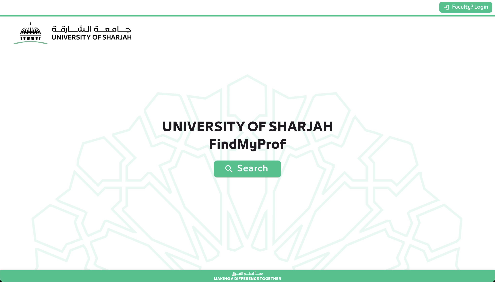
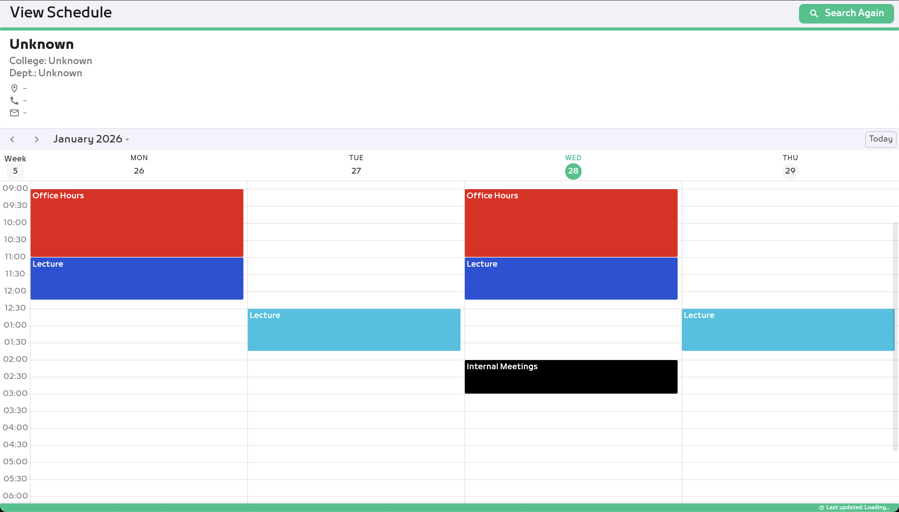
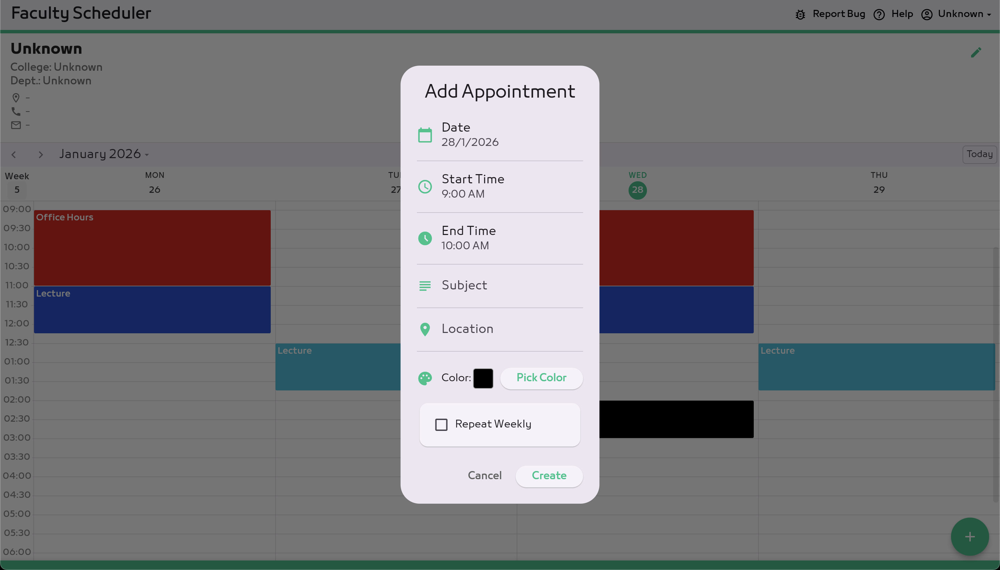
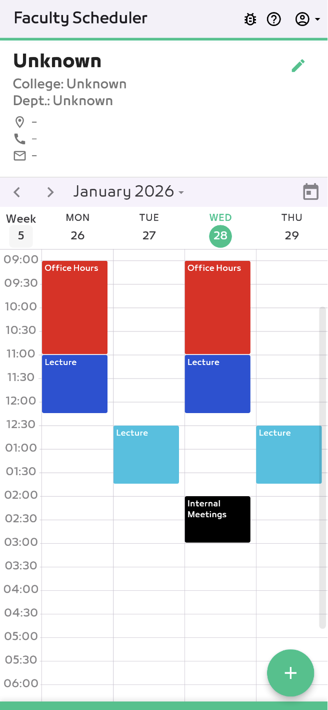

# FindMyProf – Faculty Office Hours Finder

## What This Is?

A web app I built to help students find faculty office hours more easily. Before this, students had to dig through emails or whatsapp chats to find professors schedules.

**The Problem**: Finding faculty office hours was annoying and time-consuming.  
**My Solution**: A simple, searchable web app that shows all office hours in one place.

---

## Why I Built This?

I was frustrated with how hard it was to find my professors' office hours, and I figured other students probably felt the same way. So I decided to build something to fix it! Plus, it was a great opportunity to learn Flutter and Firebase.

---

## Features

- **Quick search** for any faculty member
- **Works on any device** (phone, tablet, computer)
- **Real-time updates** - professors can update their schedules and students see changes immediately
- **Separate logins** for students (view only) and faculty (can edit)
- **Office locations** included with each schedule

---

## What I Used

- **Frontend**: Flutter (my first Flutter project!)
- **Database**: Firebase Firestore for storing schedules
- **Authentication**: Firebase Auth for login
- **Hosting**: Vercel (free tier)
- **Version Control**: GitHub

---

## Screenshots

### Search Page

*Students can search for professors by name or department*

### Office Hours View

*Shows office hours, location, and whether they're available today*

### Faculty Dashboard

*Professors can log in and update their schedules*

### Mobile View

*Works great on phones too!*

---

## What Worked Well

- Students seem to actually use it! Last I checked, around 50+ students were using it regularly
- Faculty members found it easy to update their schedules
- No more outdated information since everything updates in real-time

---

## Challenges I Faced

### 1. Learning Flutter
This was my first Flutter project, so there was definitely a learning curve. Spent a lot of time on Stack Overflow figuring out how to make things responsive.

### 2. Real-Time Data Sync
Getting Firebase to update everyone's screens instantly was tricky at first. Had to learn about listeners and state management.

### 3. Different User Types
Making sure students couldn't edit schedules while faculty could was interesting. Learned about role-based authentication.

### 4. Making It Look Good Everywhere
Getting the app to look nice on phones, tablets, and computers took more time than I expected. Responsive design is hard!

### 5. Convincing faculty members to use it.
Convincing professors to actually use the platform was harder than building it. I had to clearly explain the benefits and keep the interface simple so updating office hours didn’t feel like extra work.

---

## What I Learned

- **Flutter basics**: widgets, state management, navigation
- **Firebase**: Firestore database structure, real-time listeners, authentication
- **Deployment**: How to deploy a web app and set up continuous deployment
- **UI/UX**: Making things actually usable (turns out, harder than it looks)
- **Git workflow**: Branching, committing, pushing to production

---

## If I Had More Time...

Some things I'd like to add:
- Email notifications when office hours change
- Ability to "favorite" certain professors
- Show if the professor is currently in office
- Integration with university calendar
- Dark mode
- multi language

---

## About This Repo

This is a showcase repository - I'm keeping the actual code private since it's connected to my university. But I'm happy to talk about how I built it or answer any questions!

---

## Reflections
This was a really rewarding project because people actually use it! I learned way more building this than I did from just doing coursework. The best part? Seeing other students actually find it helpful.
Made some design decisions along the way that I'd probably change now, but that's how you learn and improve.

---

## Questions or Feedbacks?

Feel free to reach out!

- 📧 **Email**: your.email@example.com
- 💼 **LinkedIn**: [Connect with me](https://linkedin.com/in/yourprofile)

---
